## 关于运行和编译
### 第一个代码块如何编译
```
// myfirst.cpp -- displays amessage

#include <iostream>
int main()
{
	using namespace std;
	cout << "Come up amd C++ me some time.";
	cout endl;
	cout << "You won't regret it!" << endl;
	cin.get();
	return 0;
}
```
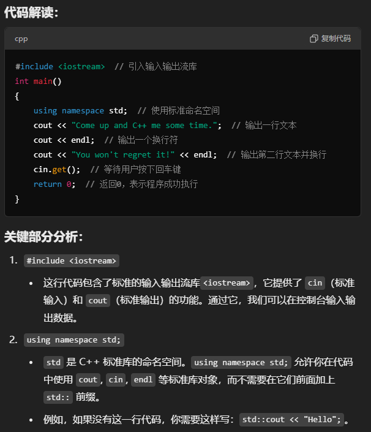
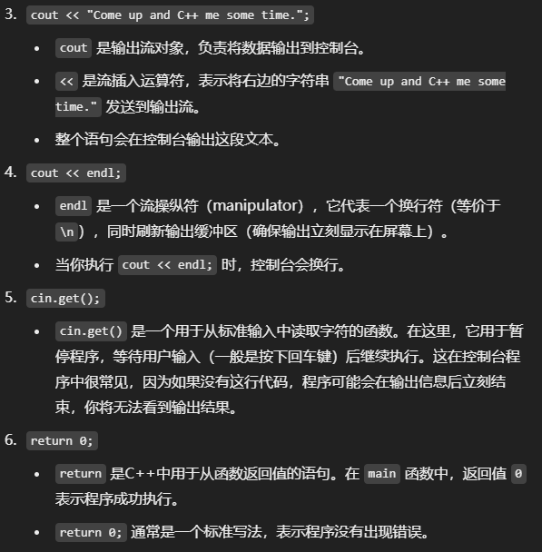
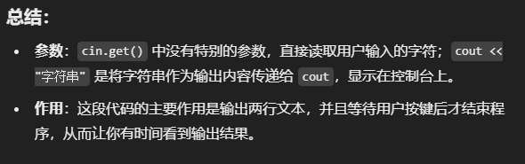
### 答疑
- 打开项目或文件

- 在Visual Studio中打开你创建的myfirst.cpp文件。
- 如果你没有创建项目，可以新建一个C++空项目，然后将myfirst.cpp添加到项目中。
- 编译并运行程序

- 在Visual Studio 2022中，点击**“生成”菜单，选择“生成解决方案”**，这会编译你的代码。
- 编译成功后，点击**“调试”菜单下的“开始执行(不调试)”**，或者按Ctrl + F5，这会运行你的程序，并显示输出结果。<br>
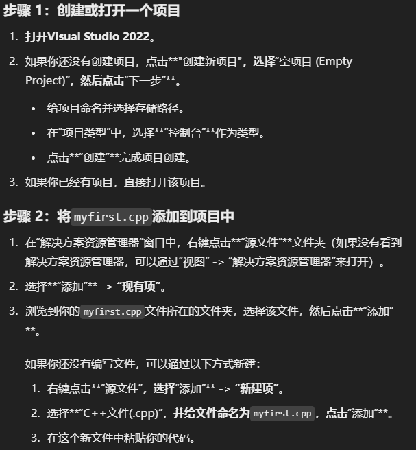
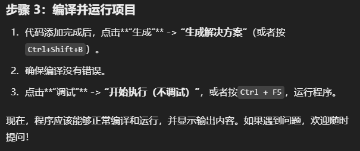

### 第二个代码块
```
#include <iostream>  // 包含输入输出流库，用于输入和输出操作

int main()  // 主函数，程序的入口点
{
    using namespace std;  // 告诉编译器使用标准命名空间std，这样就可以省略std::前缀

    int carrots;  // 定义一个整型变量carrots

    carrots = 25;  // 将变量carrots的值初始化为25
    cout << "I have ";  // 输出文本 "I have "
    cout << carrots;  // 输出变量carrots的值，这里是25
    cout << " carrots.";  // 输出文本 " carrots."
    cout << endl;  // 输出一个换行符

    carrots = carrots - 1;  // 将carrots的值减少1，现在carrots的值变为24
    cout << "Crunch, crunch. Now I have " << carrots << " carrots." << endl;  // 输出更新后的carrots值
    return 0;  // 程序成功结束，返回0
}
```
### 运行和答疑
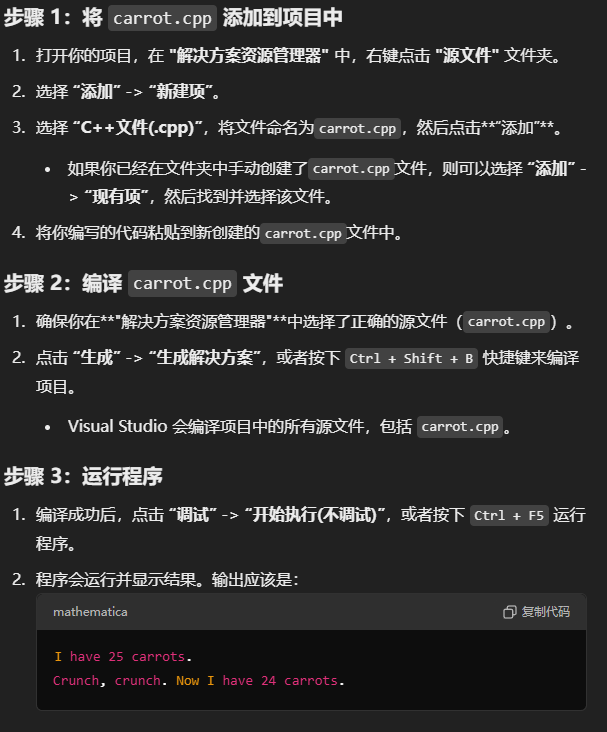
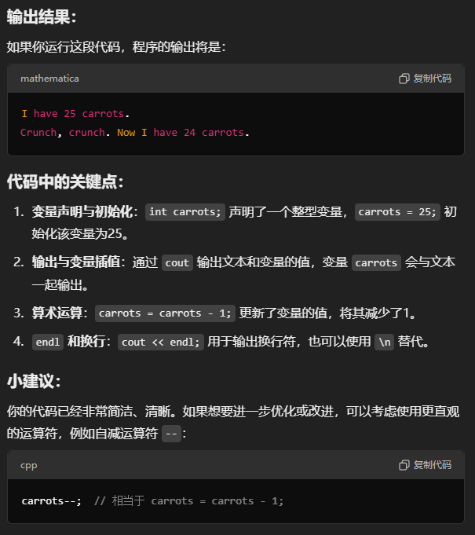
- 修改后的代码会变成：
```
#include <iostream>

int main()
{
    using namespace std;

    int carrots = 25;  // 声明并初始化变量
    cout << "I have " << carrots << " carrots." << endl;
    carrots--;  // 使用自减运算符减少1
    cout << "Crunch, crunch. Now I have " << carrots << " carrots." << endl;
    return 0;
}
```
### 第三个代码块
```
#include <iostream>  // 引入输入输出流库

int main()
{
    using namespace std;  // 使用标准命名空间

    int carrots;  // 声明一个整型变量用于存储胡萝卜的数量

    // 提示用户输入胡萝卜数量
    cout << "How many carrots do you have?" << endl;

    // 从用户输入中读取胡萝卜数量并存储到变量 carrots 中
    cin >> carrots;

    // 输出提示，表示增加了两根胡萝卜
    cout << "Here are two more.";

    // 将胡萝卜数量增加 2
    carrots = carrots + 2;

    // 输出当前胡萝卜的总数，使用 << 进行输出的连接
    cout << "Now you have " << carrots << " carrots." << endl;

    return 0;  // 返回 0 表示程序成功执行
}
```
### 运行和答疑
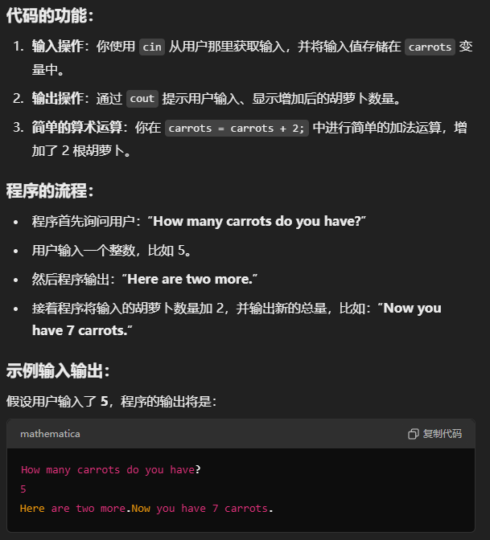
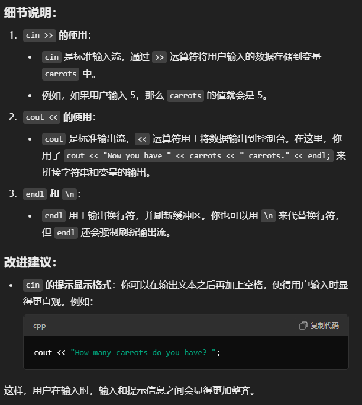
### 第四个代码块
```
#include <iostream>  // 包含输入输出流库
#include <cmath>     // 包含数学函数库，例如 sqrt()

int main()
{
    using namespace std;  // 使用标准命名空间

    double area;  // 声明一个双精度浮点数变量用于存储输入的面积
    cout << "Enter the floor area, in square feet, of your home: ";  // 提示用户输入房屋面积
    cin >> area;  // 从用户那里获取面积的输入并存储在 area 中

    double side;  // 声明一个双精度浮点数变量用于存储边长
    side = sqrt(area);  // 使用 sqrt() 函数计算面积对应的正方形边长

    // 输出边长，说明这是一个等价于给定面积的正方形的边长
    cout << "That's the equivalent of a square " << side
         << " feet to the side." << endl;

    // 输出附加信息
    cout << "How fascinating!" << endl;
    
    return 0;  // 返回 0，表示程序成功结束
}
```
### 运行和答疑
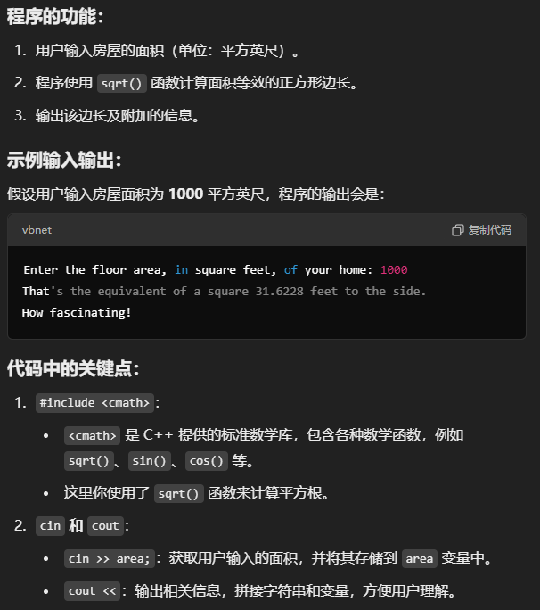
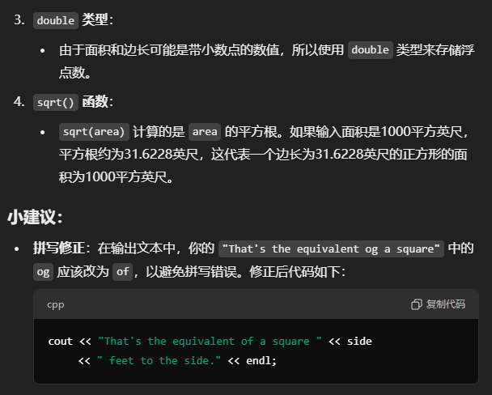
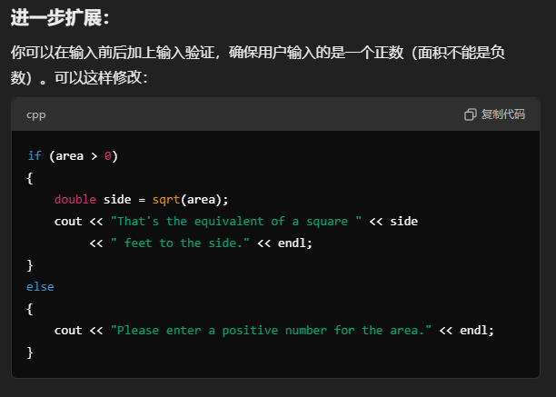
### 第五个代码块
```
#include <iostream>  // 包含输入输出流库

// 函数原型声明：告诉编译器有一个名为 simon 的函数，它接受一个 int 参数，不返回值
void simon(int);

int main()
{
    using namespace std;

    // 调用 simon 函数，传递参数 3
    simon(3);

    // 提示用户输入一个整数
    cout << "Pick an integer: ";
    int count;
    cin >> count;  // 获取用户输入的整数

    // 再次调用 simon 函数，传递用户输入的整数
    simon(count);

    cout << "Done!" << endl;  // 输出 "Done!"
    return 0;  // 程序成功结束
}

// 定义 simon 函数，接受一个 int 类型的参数 n
void simon(int n)
{
    using namespace std;

    // 输出指示信息
    cout << "Simon says touch your toes " << n << " times." << endl;
}
```
### 运行和答疑
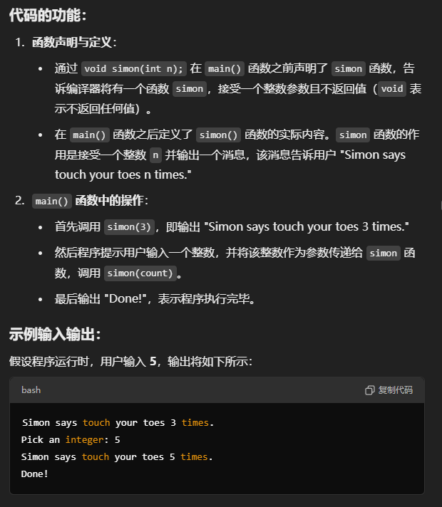
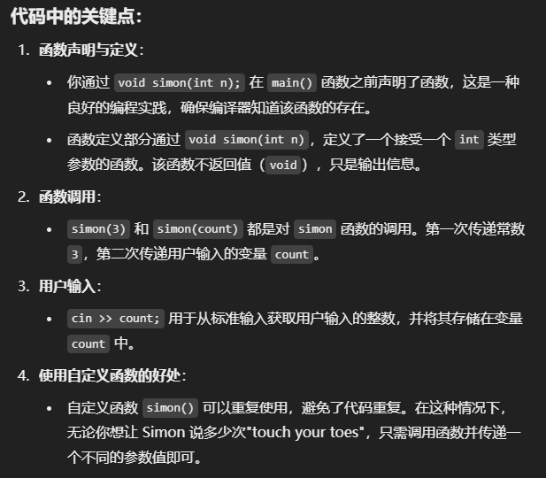
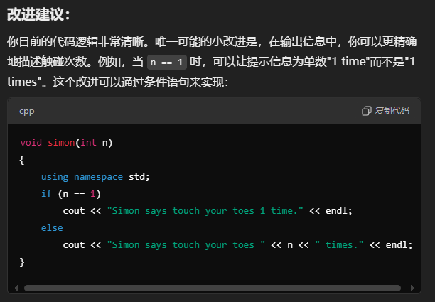
### 第六个代码块
```
#include <iostream>  // 包含输入输出流库

// 函数原型声明：将 stone 转换为 pounds 的函数
int stonetolb(int);

int main()
{
    using namespace std;

    int stone;  // 声明一个变量，用于存储用户输入的石的数量
    cout << "Enter the weight in stone: ";  // 提示用户输入石的数量
    cin >> stone;  // 获取用户输入的石的值

    // 调用 stonetolb 函数，将 stone 转换为磅
    int pounds = stonetolb(stone);

    // 输出转换结果
    cout << stone << " stone = ";
    cout << pounds << " pounds." << endl;

    return 0;  // 程序成功结束
}

// 函数定义：将石 (stone) 转换为磅 (pounds)
int stonetolb(int sts)
{
    return 14 * sts;  // 1 stone = 14 pounds
}
```
### 运行和答疑
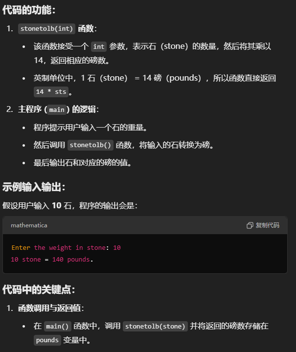
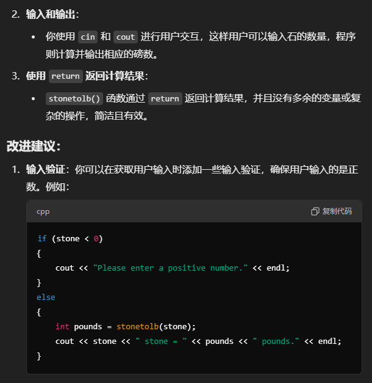
### 习题集批改
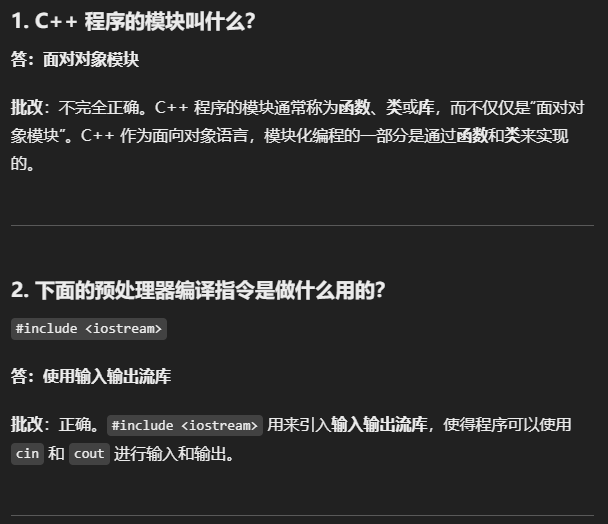
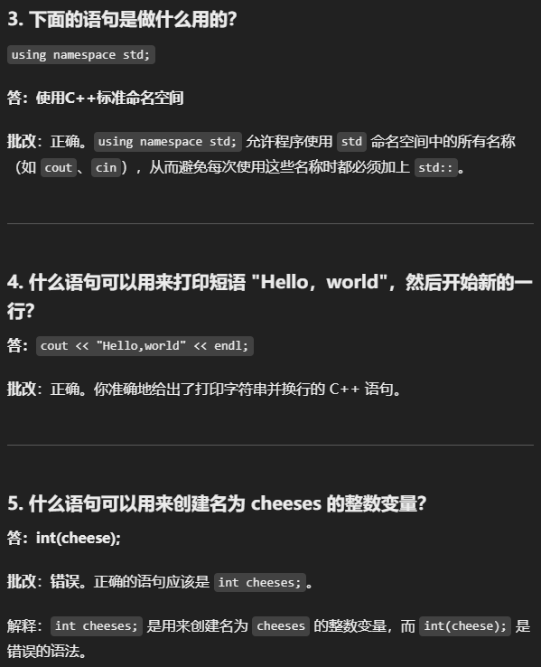
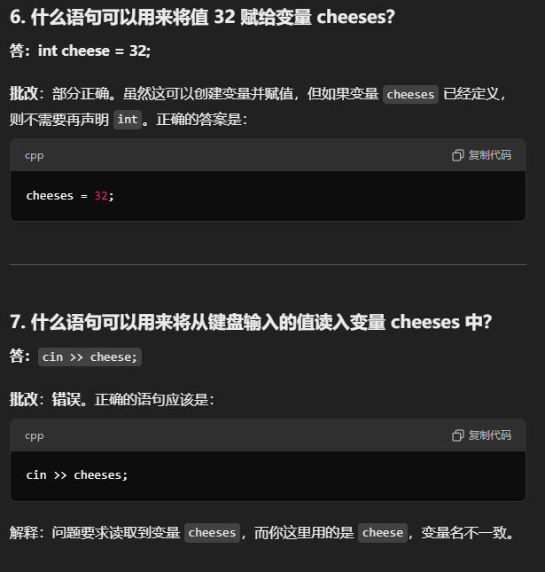
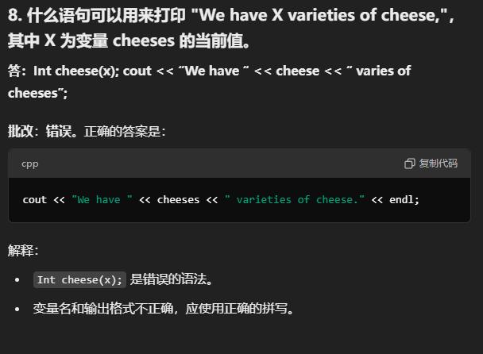
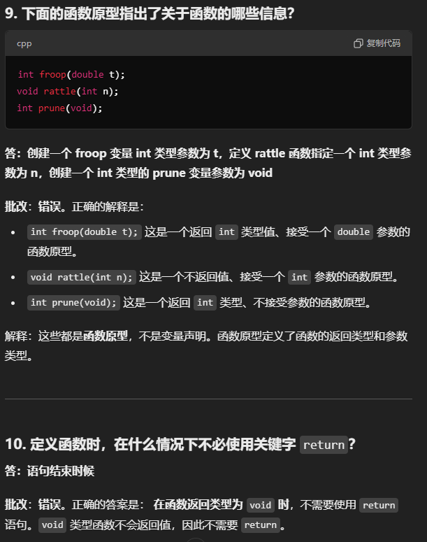
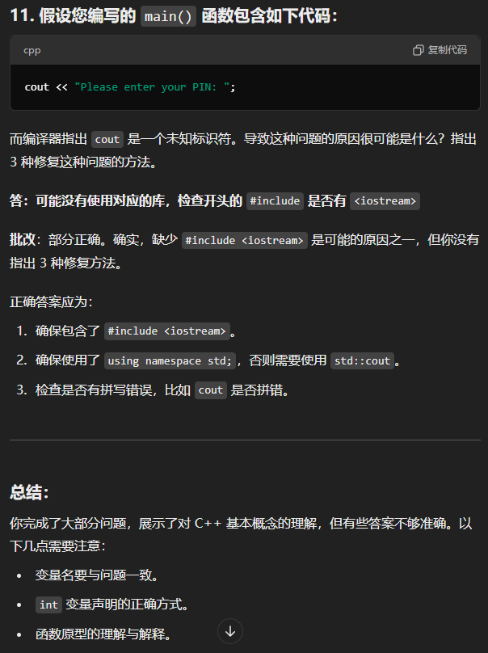


